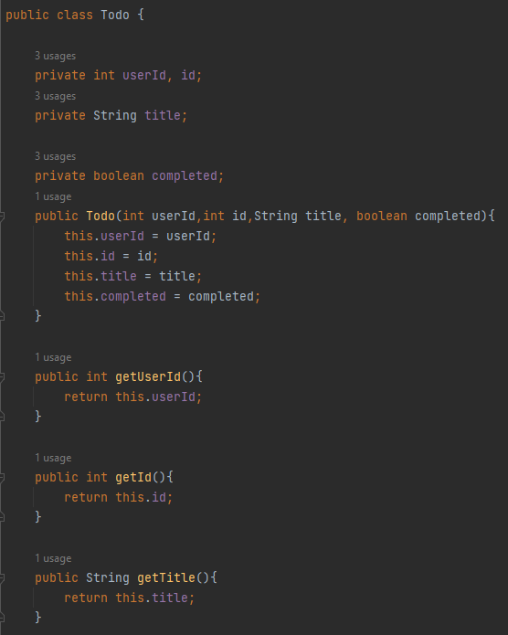

# LAB 5 - MVC Prime Faces - Juan López

## Parte 1 - Jugando a ser un cliente HTTP

Para empezar realizamos una conexión con Telnet utilizando como host "www.escuelaing.edu.co" y "80" como puerto. Es decir, entramos a CMD e ingresamos el siguiente comando:
```telnet www.escuelaing.edu.co 80```


Si en un PC Windows no se reconoce "telnet" como un comando es que esta característica no está activada en Windows. Por lo tanto, hay que ir a "Activar o desactivar características de Windows":
&nbsp;


&nbsp;

Una vez ahí, hay que cerciorarse que la opción "Cliente Telnet" esté seleccionada:

&nbsp;

Ya con esta opción seleccionada se podrá realizar los comandos telnet. Y si realizamos la conexión a "www.escuelaing.edu.co" tenemos el siguiente resultado:
&nbsp;


&nbsp;

Ya con la conexión generada debemos realizar una petición GET del recurso "sssss/abc.html" con la versión 1.0 de HTTP, esto lo logramos con el siguiente comando: ```GET /sssss/abc.html HTTP/1.0``` y para ejecutarlo oprimir ENTER dos veces.

Una vez hecho esto obtenemos el siguiete error:
&nbsp;


Revisando la [lista de códigos de estado HTTP](https://en.wikipedia.org/wiki/List_of_HTTP_status_codes) podemos ver que este código de error ("400 Bad request") pertenece al grupo de errores de cliente y significa que la solicitud está mal escrita o es una solicitud errónea.
También tenemos los siguientes códigos:
* 401 *Unauthorized*: cuando se requiere autenticación pero no se da o está falla (como por datos ingresados erróneos).
* 402 *Payment required*: originalmente pensado para ser usado en casos de micropagos, sin embargo, hoy en día se usa cuando, por ejemplo, en el API Google Developers, si un  desarrollador ha excedido el límite diario de peticiones.
* 403 *Forbidden*: cuando la petición es correcta pero usuario no tiene los permisos para el recurso en cuestión.
* 404 *Not found*: cuando el recurso solicitado no se encuentra pero puede ser encontrado en el futuro.
* 405 *Method not allowed*: cuando el método utilizado para obtener el recurso no es válido para el recurso en cuestión, por ejemplo, si el recurso es *read-only* solo se puede obtener con el método ```PUT```, si se intenta con ```GET``` se generará este error.
* 406 *Not acceptable*: cuando el recurso tiene contenido que el *accept* del encabezado de la petición no aceptará.
* 407 *Proxy authentication required*: el cliente primero debe autenticarse con el *proxy* primero.
* 408 *Request timeout*: cuando el servidor espera demasiado tiempo para que el usuario haga una petición.
* 409 *Conflict*: cuando hay un conflicto con el estado actual del recurso solicitado, como cuando se está editando y se generan cambios mientras se solicita.
* 410 *Gone*: cuando el recurso solicitado estaba disponible pero ahora ha sido eliminado y no volverá a estar disponible.
* 411 *Length required*: cuando la petición no contiene la longitud del recurso solicitado y este lo necesita para ser "invocado".
* 412 *Precondition failed*: cuando el servidor no cumple con una (o más) de las condiciones establecidas por el usuario en los campos del encabezado de la solicitud.
* 413 *Payload too large*: la carga de la petición es más grande de lo que el servidor puede procesar.
* 414 *URI too long*: cuando el identificador del recurso es más largo de lo que el servidor puede procesar.
* 415 *Unsupported media type*: cuando la entidad que hace la petición tiene un identificador de formato de archivo que el recurso no cumple.
* 416 *Range not satisfiable*: cuando el cliente realiza la petición para una porción específica de un archivo y el servidor no puede dar esa porción.
* 417 *Expectation failed*: cuando el servidor no puede cumplir los requerimientos del encabezado *expect* de la petición.
* 418 *I'm a teapot*: no se implementa, es un chiste que surgió como un *April Fools' joke*.
* 421 *Misdirect request*: cuando la petición se dirije a un servidor que no puede producir una respuesta.
* 422 *Unprocessable entity*: cuando hay errores semánticos en la petición.
* 423 *Locked*: cuando el recurso al que se intenta acceder está bloqueado.
* 424 *Failed dependency*: cuando la petición falla porque esta dependía de otras peticiones que fallaron.
* 425 *Too early*: cuando un servidor no ejecuta la petición por el riesgo de que esta sera ejecutada múltiples veces a continuación.
* 426 *Upgrade required*: cuando el cliente debería cambiar de protocolo.
* 428 *Precondition required*: cuando el servidor requiere que la petición esté condicionada.
* 429 *Too many requests*: cuando el usuario ha enviado demasiadas peticiones en un cierto período de tiempo.
* 431 *Request header fields too large*: cuando hay al menos un campo de los campos en el encabezado de la petición que excede el límite de longitud dado.
* 451 *Unavailable for legal reasons*: cuando se impide la petición porque el recurso en cuestión está indisponible por razones legales.

Ahora realizamos una conexión con Telnet, pero ya no a la página de la Escuela, sino al *host* "www.httpbin.org" y también en el puerto "80". Lo hacemos con el siguiente código: ```GET /html HTTP/1.0```. Y obtenemos el siguiente resultado:


Después de esto, utilizando una máquina Linux, utilizamos el comando ```wc -c``` para contar los caracteres del recurso HTML obtenido:
&nbsp;


&nbsp;

Y el resultado obtenido es que el número de caracteres es de 3742.

En la práctica no se utiliza mucho el comando ```telnet```, sino el comando ```curl```. Cuando se utiliza este comando obtenemos el siguiente resultado de la cabeza del HTML solicitado:

&nbsp;

Sin embargo, cuando utilizamos los parámetros "-v" o "-i" obtenemos los siguientes resultado:
* -v: obtenemos información extra antes del recurso HTML como tal. 
&nbsp;


* -i: también obtenemos información extra, menos la información de la conexión al servidor.
&nbsp;


## Parte 2 - Haciendo una aplicación web dinámica a bajo nivel

Como este proyecto se realizará con prácticas CI/CD, se hace el desarrollo con Azure, por lo tanto, el primer paso en este proceso es crear un proyecto en Azure DevOps con la configuración *agile*:

&nbsp;

A continuación, empieza la fase de *planning* del proyecto. En esta fase se crea el *backlog* y se establece las historias de usuario, las tareas a realizar para cada historia y cuáles de estas realizar en el primer *sprint*. En este caso el backlog del primer sprint quedó así:


Y ahora empezamos con el proceso de creación y configuración del proyecto. Para hacer esto, en IntelliJ creamos el proyecto con las siguientes propiedades:
&nbsp;


Una vez creado el proyecto hacemos el primer commit en Git. Luego, empezamos a trabajar. Lo primero que se realiza es la clase "SampleServlet":

&nbsp;

Después de crear esta clase se empiezan a hacer cambios en el pom. Para empezar se añade la dependencia del api web del grupo javax:
&nbsp;


Añadimos también, debido a que se va a hacer análisis estático del código, una propiedad para hacer uso de "SonarCloud":


Y finalmente, para terminar la configuración inicial del pom, insertamos los plugins necesarios para que funcione tomcat, war y el compilador de maven correctamente:
&nbsp;


Empaquetamos para verificar que todo está funcionando:


Hacemos commit.
&nbsp;


Y ahora completamos la última tarea de la primera historia creada en el *backlog*, la cual es el *testing* con tomcat del "SampleServlet", la cual se logra con el comando ```mvn tomcat7:run```:
&nbsp;


Ahora podemos probar el hecho de que el "SampleServlet" recibe un valor de parámetro llamado "name". Testeamos esto con la siguiente búsqueda en el navegador:
 Y obtenemos el siguiente resultado: 


Como paso siguiente añadimos el artefacto gson del repositorio de maven:


Luego podemos testear lo que hace cambiar una variable del path en el URL:


Después de esto, debemos basarnos en este ejemplo para lograr lo que queremos en nuestro proyecto. Para poder hacer esto debemos analizar bien cómo funciona la clase que nos dan ("Service") para poder 
crear la clase "Todo" y así completar los métodos *getter* y *setter* de esta clase para que todo en "Service" funcione:



Ahora hay que hacer una nueva clase basada en el "SampleServlet" que se nos dio previamente. En esta clase tenemos que crear el método "doGet" (así como en "SampleServlet"):
&nbsp;


Ya una vez hecho esto, podemos empezar a implementar el método "doGet":
